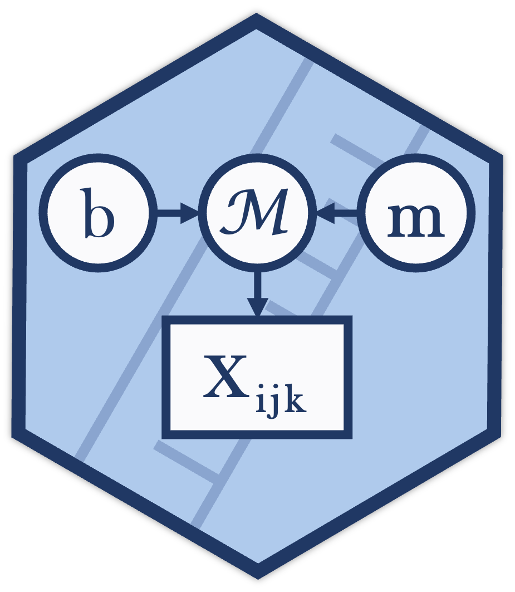

In addition to my research, I develop open source software. The package I work on wraps cognitive measurement models in a `brms`-compatible interface, so fitting them feels more like running a regression than writing a custom sampler. Below you can find an overview of my open source software contributions.

---

## bmm

:::: {.columns}

::: {.column width="20%"}

:::

::: {.column width="5%"}
:::

::: {.column width="75%"}

**bmm: Bayesian Measurement Models for Cognitive Processes**

Role: Co-author and maintainer

[Website](https://venpopov.com/bmm/index.html){.btn .btn-outline-primary .btn-sm role="button"} 
[GitHub](https://github.com/venpopov/bmm){.btn .btn-outline-primary .btn-sm role="button"} 
[Issues](https://github.com/venpopov/bmm/issues){.btn .btn-outline-primary .btn-sm role="button"}

:::

::::

`bmm` is an R package I co-develop with [Ven Popov](https://venpopov.com) for fitting cognitive measurement models in a hierarchical Bayesian framework. It builds on [`brms`](https://paul-buerkner.github.io/brms/) and Stan, and uses the same formula syntax. If you know brms, you already know most of how bmm works.

The current focus is measurement models for  working memory. `bmm` implements different measurement models all in one place, providing a flexible and user-friendly interface for Bayesian hierarchical mixture models and related cognitive measurement models.

### Install

```r
# From CRAN
install.packages("bmm")

# Development version
remotes::install_github("venpopov/bmm")
```

### Selected References

- Frischkorn, G. T., & Popov, V. (2025). A tutorial for estimating Bayesian hierarchical mixture models for visual working memory tasks: Introducing the Bayesian Measurement Modeling (bmm) package for R. *Behavior Research Methods, 57*(5), 144. [https://doi.org/10.3758/s13428-025-02643-0](https://doi.org/10.3758/s13428-025-02643-0){target="_blank"}
