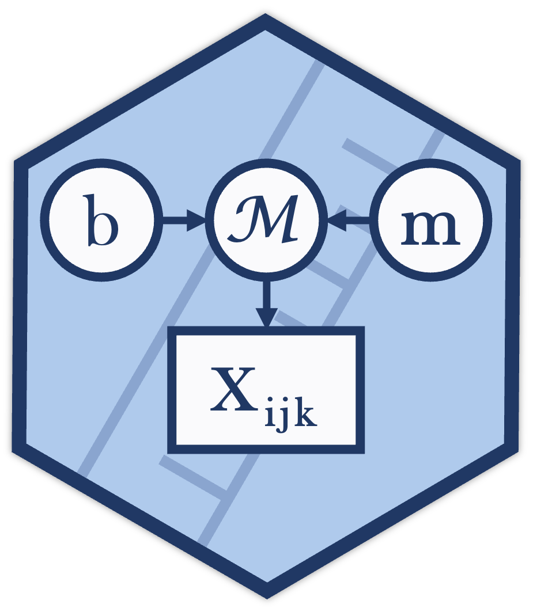
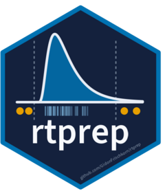

In addition to my research, I develop open source software. All three packages below started as a problem in my own work: fitting cognitive measurement models without writing a custom sampler, deciding what to do with response times before analysing them, and getting data out of JATOS without the token ending up in a script.

---

## bmm

:::: {.columns}

::: {.column width="20%"}

:::

::: {.column width="5%"}
:::

::: {.column width="75%"}

**bmm: Bayesian Measurement Models for Cognitive Processes**

Role: Co-author and maintainer

[Website](https://venpopov.com/bmm/index.html){.btn .btn-outline-primary .btn-sm role="button"}
[GitHub](https://github.com/popov-lab/bmm){.btn .btn-outline-primary .btn-sm role="button"}
[Issues](https://github.com/popov-lab/bmm/issues){.btn .btn-outline-primary .btn-sm role="button"}

:::

::::

`bmm` is an R package I co-develop with [Ven Popov](https://venpopov.com) for fitting cognitive measurement models in a hierarchical Bayesian framework. It builds on [`brms`](https://paul-buerkner.github.io/brms/) and Stan, and uses the same formula syntax. If you know brms, you already know most of how bmm works.

The current focus is measurement models for  working memory. `bmm` implements multiple measurement models in one place, with a consistent interface across model families.

### Install

```r
# From CRAN
install.packages("bmm")

# Development version
# install.packages("pak")
pak::pak("popov-lab/bmm")
```

### Selected References

- Frischkorn, G. T., & Popov, V. (2025). A tutorial for estimating Bayesian hierarchical mixture models for visual working memory tasks: Introducing the Bayesian Measurement Modeling (bmm) package for R. *Behavior Research Methods, 57*(5), 144. [https://doi.org/10.3758/s13428-025-02643-0](https://doi.org/10.3758/s13428-025-02643-0){target="_blank"}

---

## rtprep

:::: {.columns}

::: {.column width="20%"}

:::

::: {.column width="5%"}
:::

::: {.column width="75%"}

**rtprep: Screening, Trimming, and Aggregating Response Time Data**

Role: Author and maintainer

[Website](https://www.gfrischkorn.org/rtprep/){.btn .btn-outline-primary .btn-sm role="button"}
[GitHub](https://github.com/GidonFrischkorn/rtprep){.btn .btn-outline-primary .btn-sm role="button"}
[Issues](https://github.com/GidonFrischkorn/rtprep/issues){.btn .btn-outline-primary .btn-sm role="button"}

:::

::::

Every response time analysis makes an exclusion decision, and most inherit it by convention: 200 ms and 3 s because that is what the last paper did, ±2.5 *SD* because that is what the field does. Better methods exist, but they are scattered across packages, and each returns a different kind of object — a trimmed data frame, a vector of per-trial probabilities, a set of summary statistics. That makes the choices impossible to compare.

`rtprep` gives them one interface. Absolute cutoffs, standard deviation and median absolute deviation criteria, recursive moving criteria, and model-based mixture flagging all return the same per-trial object, and diagnostics report what each rule removed and where two defensible rules disagree on your own data. The package also generates response times with contaminants of known type, so a pipeline can be tested against ground truth rather than trusted.

*Submitted to CRAN and currently under review; available from R-universe until it is accepted.*

### Install

```r
# From R-universe
install.packages("rtprep", repos = "https://gidonfrischkorn.r-universe.dev")

# Development version
# install.packages("pak")
pak::pak("GidonFrischkorn/rtprep")
```

---

## jatosr

:::: {.columns}

::: {.column width="20%"}

:::

::: {.column width="5%"}
:::

::: {.column width="75%"}

**jatosr: Download and Manage JATOS Study Data**

Role: Author and maintainer

[Website](https://www.gfrischkorn.org/jatosr/){.btn .btn-outline-primary .btn-sm role="button"}
[GitHub](https://github.com/GidonFrischkorn/jatosr){.btn .btn-outline-primary .btn-sm role="button"}
[Issues](https://github.com/GidonFrischkorn/jatosr/issues){.btn .btn-outline-primary .btn-sm role="button"}

:::

::::

`jatosr` is an R client for the REST API of [JATOS](https://www.jatos.org). The API token lives in the credential store of the operating system, never in a script; on a server or in CI it is read from an environment variable instead.

One call retrieves the result metadata, downloads result data and uploaded files incrementally into a local cache, reads the [jsPsych](https://www.jspsych.org) JSON files into one table of trials with each run's metadata joined, and writes it as `.rds`, `.csv`, `.tsv`, `.parquet` or `.RData` with a provenance record beside it. The retrieval workflow is modelled on the JATOS functions in [smartr](https://github.com/chenyu-psy/smartr) by Chenyu Li.

*Version 0.1.0 is in beta testing; CRAN submission is planned for October 2026.*

### Install

```r
# install.packages("pak")
pak::pak("GidonFrischkorn/jatosr")
```
